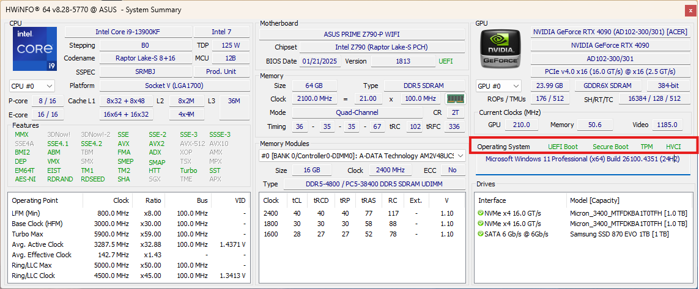

# NixOS on Orion 7000, dual boot host

Configuration and documentation for NixOS dual boot with Windows 11 on Acer Predator Orion 7000.

## Table of Contents

- [Installation](#installation)
    - [Partitioning the hard drives](#partitioning-the-hard-drives)
    - [Installing NixOS](#installing-nixos)
- [LUKS encryption FIDO2](#luks-encryption-fido2)
- [Custom Secure Boot](#custom-secure-boot)
- [Jetbrains remote work](#jetbrains-remote-work)
- [Nvidia](#nvidia)
- [Bluetooth](#bluetooth)
- [Fan control](#fan-control)
- [GNOME](#gnome)
- [Handle secrets](#handle-secrets)
    - [Deploying secrets](#deploying-secrets)
    - [Encrypt & decrypt secrets using sops, age & YubiKey](#encrypt--decrypt-secrets-using-sops-age--yubikey)

## Installation

### Partitioning the hard drives

It's recommended to start with a Windows 11 installation. Boot into the motherboard firmware and disable
UEFI secure boot. Then you can use a tool like _MiniTool Partition Wizard Free_ to shrink the system (C:/) and
expand the ESP drive. Changes will be loaded and performed before next boot. Make the ESP drive bigger than you need.
Mine is 6 GB, but 1,5 GB should be enough. If the ESP partition is in the beginning of the disk, and you can't move
the system partition further on you have to manage your partitions from a bootable USB disk.

**Creating the NixOS partition table**

_This is based on notes from my last installation and may not be completely accurate._

`lsblk` with and without the -f flag and `sudo fdisk -l` can be used to list disks and partition table.

Use [**fdisk**](https://www.man7.org/linux/man-pages/man8/fdisk.8.html) to create partitions:
- Target correct disk: `sudo fdisk /dev/nvme0n1`
- `n` to create partition
- `t` to change partition type
- `w` to write changes
- Create a ROOT partition (filled up unallocated space)
  - Formatted as BTRFS: `sudo mkfs.btrfs /dev/nvme0n1p6`
  - Label NIXROOT: `sudo btrfs filesystem label /dev/nvme0n1p6 NIXROOT`

### Installing NixOS

See the `hosts/iso` project on how to create a bootable USB and install NixOS.

## LUKS encryption FIDO2

The NIXROOT filesystem is LUKS encrypted and can be unlocked during Initial ramdisk ("early boot stage"),
with a YubiKey or a backup password.

**List all suitable FIDO2 security tokens**

```
systemd-cryptenroll --fido2-device=list
```

**Re-enroll YubiKey's**

```
sudo cryptsetup status encrypted-nix-root
sudo cryptsetup luksDump /dev/nvme0n1p6
sudo systemd-cryptenroll --wipe-slot=1 /dev/nvme0n1p6
sudo systemd-cryptenroll --wipe-slot=2 /dev/nvme0n1p6
sudo systemd-cryptenroll --fido2-device=auto --fido2-with-client-pin=yes --fido2-with-user-presence=yes /dev/nvme0n1p6
```

For remote work via SSH,
[USB over IP](https://github.com/torvalds/linux/tree/master/tools/usb/usbip) is needed.

Use the scripts in `./boot-initrd-scripts` to bind the YubiKey locally and attach the YubiKey to the remote host.

The unlock LUKS on boot experience, step by step:
1. Make sure Yubikey is unbound (usbip server)
2. Connect to host as root with SSH and use the Yubikey private key as identity (ssh config)
3. Bind Yubikey (usbip server)
4. Attach Yubikey (usbip client)
5. Unlock LUKS filesystem
6. After entering PIN and touching the YubiKey; the system continues to stage two and the SSH connection is broken
7. Repeat step 1-4 but login to SSH as <user>

The usbip server is running on the SSH client side. Other way around: the usbip client is running on the SSH host side.

**Client SSH configuration**

```
Host orion-boot
      HostName 192.168.2.106
      port 22
      user root
      IdentitiesOnly yes
      IdentityFile ~/.ssh/id_ed25519_sk_rk_github.com
      RequestTTY yes
      ForwardAgent no
      RemoteForward 3240 localhost:3240
Host orion
      HostName 192.168.2.106
      port 22
      user jonatan
      IdentitiesOnly yes
      IdentityFile ~/.ssh/id_ed25519_sk_rk_github.com
      ForwardAgent no
      RemoteForward 3240 localhost:3240
```

The _usbusers_ group and the additional device manager rules (udev) ensure that users can remotely use the YubiKey for
signing git commits, fetching git changes, and running commands such as `usbip port` and `gpg --card-status` without
requiring root access.

## Custom Secure Boot

I put the UEFI Secure Boot in "setup" mode, generated keys with `sbctl` migrated them from /etc/secureboot to
/var/lib/sbctl. Finally, the keys were enrolled to the motherboard and the UEFI Windows Secure Boot was activated.

The UEFI Windows Secure Boot is supported by following these steps:
- Put the UEFI Secure Boot in "setup" mode
- Generate keys with `sbctl` and migrate them from /etc/secureboot to /var/lib/sbctl
- Enroll the keys to the motherboard
- Activate the UEFI Windows Secure Boot

```
❯ sudo sbctl status
Installed:	✓ sbctl is installed
Owner GUID:	e6e5318d-91c7-4ef6-8349-ae633338e5ac
Setup Mode:	✓ Disabled
Secure Boot:	✓ Enabled
Vendor Keys:	microsoft
```



- "Setup mode": OS Type = Other OS, Boot mode = Custom, Clear/Delete keys
- "Custom Secure Boot": OS Type = Windows UEFI mode, Boot mode = Custom

## Jetbrains remote work

I can't use Jetbrains Toolbox to connect to Orion via SSH. It seems that resident keys aren't supported.
I added a password protected SSH key instead with 1Password as SSH agent.

**Client SSH configuration**

```
Host orion-rider
      IdentityAgent ~/.1password/agent.sock
      HostName 192.168.2.106
      port 22
      user jonatan
      IdentitiesOnly yes
      IdentityFile ~/.ssh/id_ed25519_jonatan_nixos_orion.pub
```

## Nvidia

The system configures Nvidia open drivers and activating cooler control support. Nvidia is not handling 'suspend' as
expected, so the function is disabled.

## Bluetooth

Bluetooth is configured with the package `bluez` and the kernel modules `btusb` and `btintel`.

- Troubleshoot and follow live logs with `bluetoothctl`
- Active kernel modules can be verified by `lsmod | grep bluetooth`

## Fan control

Normally the fan control is already is built in and optimized but...
I fucked up the motherboard by hard reset during ME firmware update and had to buy a new motherboard.
No spare parts was available, so I ordered and installed a Asus Prime Z790-P Wifi board. A header is missing to
control a fan or led. Therefore, this configuration installs and configure CoolerControl.
Here is documentation of how to restore the backup:
https://docs.coolercontrol.org/wiki/config-files.html#backup-import

## GNOME

I've struggled a lot with a tiling window setup. I couldn't get Hyprland to work, so I have to come back to that
at a later point. I'm now using the GNOME extension tiling-shell, with shortcuts for opening workspaces and apps.
GNOME settings can be found in `./modules/dconf/default.nix`.

## Handle secrets

### Deploying secrets

The package `sops-nix` is storing secrets decrypted in /nix/store is OK. This is OK for NixOS on my personal machines,
with only one user. This is the package, currently used for decrypt and deploy secrets encrypted with `sops` and `age`.
During the activation stage of *nixos-rebuild*, an age standard access key is used to decrypt the secrets and
[sops-nix](https://github.com/Mic92/sops-nix) is copying them to the /nix/store.

With another related package called [agenix](https://github.com/ryantm/agenix), we can mount the secrets to known paths.
Preferable one path per usage or application, with a strict permission policy. For remote machines or critical
application I plan to use identities derived from SSH-keys and `agenix`, together with a vault to handle secrets.

### Encrypt & decrypt secrets using sops, age & YubiKey

The [YubiKey plugin](https://github.com/str4d/age-plugin-yubikey) for [age](https://github.com/FiloSottile/age), called
`age-plugin-yubikey`, let us generate and export an identity, stored on the YubiKey, under the PIV section:

```
ykman piv change-pin
ykman piv change-puk
ykman piv access change-management-key --generate --protect
age-plugin-yubikey --generate
age-plugin-yubikey --identity > \
~/.config/sops/age/id_jonatan.txt
age-plugin-yubikey --list
ykman piv info
```

The YubiKey identity will contain a reference to the hardware key and can be stored openly.

The identity of the age standard access key contains a private key/secret. We should encrypt it with the YubiKey and a
strong password as a backup:

```
cd ~/.config/sops/age/
age-keygen -o id_local.txt
age-keygen -y -o r_local.txt id_local.txt
cat id_jonatan.txt >> keys.txt
cat id_local.txt >> keys.txt
# yank or copy YubiKey public key manually to r_jonatan.txt
cat r_local.txt >> recipients.txt
cat r_jonatan.txt >> recipients.txt
age -R recipients.txt id_local.txt > id_local.age
age -R recipients.txt keys.txt > keys.age
rm id_local.txt
rm keys.txt
# Before development session
age -d -i id_jonatan.txt -o keys.txt keys.age
# Before build
# Uncomment the YubiKey identity in keys.txt. sops-nix will not
# interact with the user and fail the build otherwise.
# After development session
rm keys.txt
```

The file `keys.txt` in the home age configuration folder is used to lookup age identities.

After keys in .sops.yaml changed, we re-**encrypt** the secret files:

```
sops updatekeys secrets/orion/secrets.yml
```

[sops](https://github.com/getsops/sops) keys and creation rules allow both the user 'jonatan-yubikey-23839166' and the
host 'local' to **decrypt** secrets under secrets/orion:

```
sops secrets/orion/secrets.yml
```

To check the secret in the nix store after rebuild:

```
sudo cat /run/secrets/secret1
```

---

[Back to top](#nixos-on-orion-7000-dual-boot-host)
